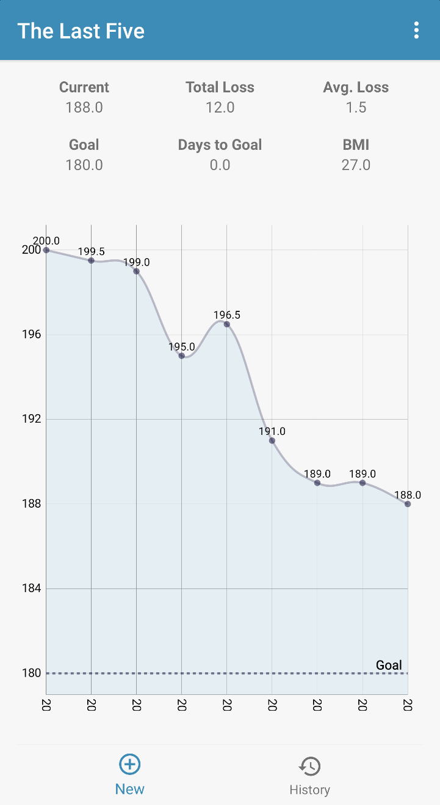
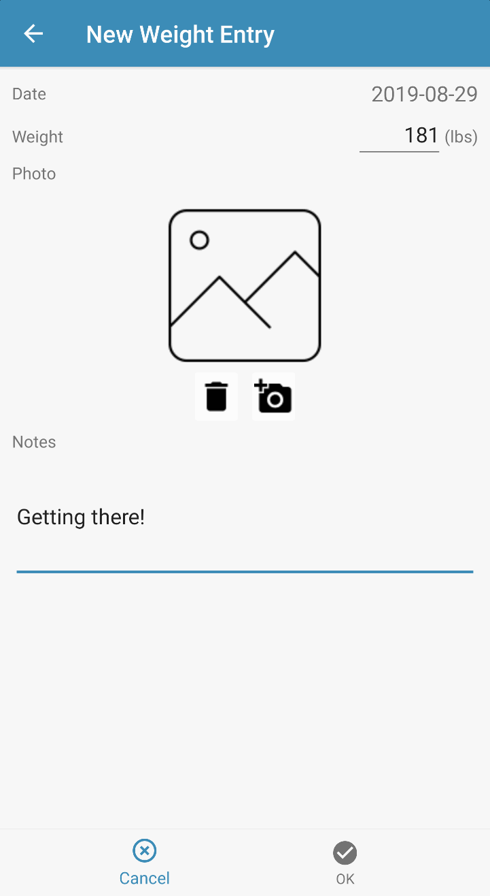
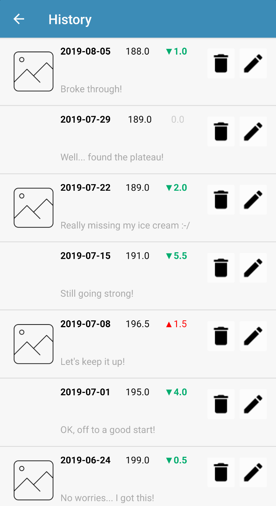
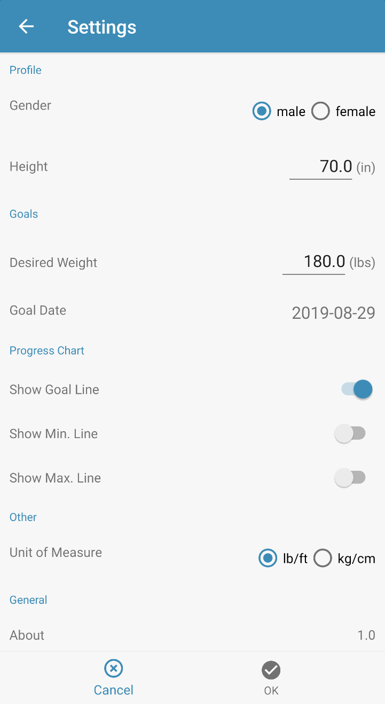

# The Last Five

> This app was created as a project for CIS 692.

## Features

This is an Android (only) app for tracking weight loss progress over time. Basic features include:
- Using the app you can enter and track:
  - Weight
  - Date
  - Photo (e.g. selfie)
  - Notes/comments
- User Profile settings, including:
  - Gender
  - Height
  - Goal weight/date
  - Unit of measure (e.g. imperial or metric)
- Progress Chart
  - Shows progress (as a line chart) over time
  - Display min./max. weight (from all entries)
  - Display goal (desired) weight on chart
- History
  - View your weight loss history as a list
  - Ability to edit individual entries
- Backup & Restore

Weight loss data is stored in a SQLite database and is _not_ synchronized to the cloud/across devices. There is no internet connectivity currently required or utilized by this app.

## Screenshots

#### Home Screen

#### New Entry

#### History Screen

#### Settings Screen

## Google Play

You can find this app in the Google Play store [here](https://play.google.com/store/apps/details?id=com.moonspace.thelastfive).

## Caveat

I am making this source code available solely as a learning opportunity for others as well as myself. I make no guarantees as to its suitability for use by anyone. :-)

If you happen to review this code and know of better ways to implement what I did (which isn't much of a stretch!) then please [let me know](https://github.com/jbramwell/TheLastFive/issues)! As a reformed Windows mobile developer, I want to continually improve my approach to writing Android apps.

Enjoy!
